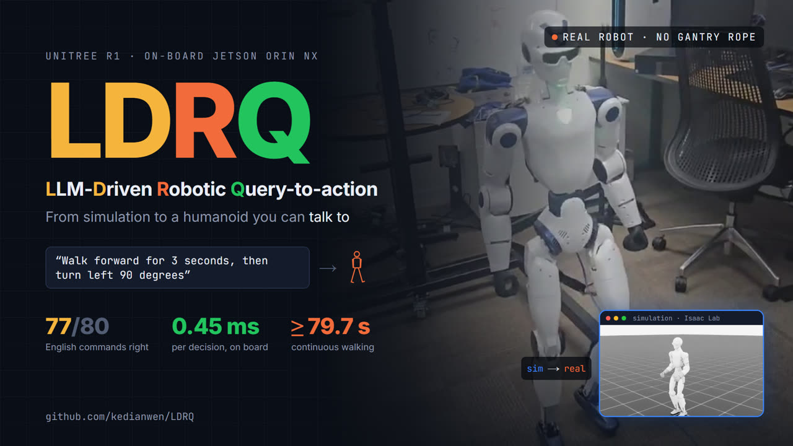

# LDRQ: a Unitree R1 humanoid from simulation to English commands

[](https://github.com/kedianwen/LDRQ/actions/workflows/tests.yml)
[](LICENSE)
[](https://github.com/kedianwen/LDRQ/releases)

[中文简介](README_zh.md)

A walking policy for the **Unitree R1** humanoid, trained in Isaac Lab, deployed on the
robot's own Jetson Orin NX, measured against the simulator, and commanded in English
through a small language model running on the robot.

<p align="center">
  <a href="docs/media/ldrq_pitch.mp4"></a>
  <br><em>Click for the 3-minute video (<a href="docs/media/ldrq_pitch.mp4">docs/media/ldrq_pitch.mp4</a>): training, deployment,
  the sim2real measurement, and English commands on the real robot.</em>
</p>

## Results at a glance

| what | result |
|---|---|
| speed tracking in simulation, 0.5–1.0 m/s | worst error **0.037 m/s** (gate 0.15), no falls |
| TensorRT on the robot against PyTorch | max difference **1.3e-5** over 512 inputs (gate 1e-3) |
| policy inference on the Orin, in the 50 Hz loop | **~0.45 ms** of a 20 ms step |
| continuous walking without the gantry | **≥ 79.7 s** |
| tolerated actuator stiffness, `kp_scale` | simulator **0.80–2.00+**, real robot **1.10–1.50**; the gap is posture, not joint tracking |
| closed-loop turns on the robot | 10/10 within **1.6°** by the IMU |
| English sentence → checked plan, held-out test sets | **77/80** on the Orin, 0.65 s median; 11/11 instructions right end to end |
| swapping the policy | **one command**, 8 checked steps; 3/3 bad bundles refused before any change |

The full account is [docs/technical_report.md](docs/technical_report.md); how the work was
organized and what each step found is [docs/project_history.md](docs/project_history.md).

## How it fits together


An English sentence becomes a plan once, before the robot moves: the model only
transcribes, deterministic code checks the plan against what the policy was trained on,
and the operator confirms. Below that, the command layer (10 Hz), the policy (50 Hz) and
the motor loop (500 Hz) each have their own safety checks. Details and the logic diagram:
[docs/system_architecture.md](docs/system_architecture.md).

## Quick start

Pick the row that matches what you have. Everything in the first two rows runs on any
machine with Python 3.8+, with no GPU, no ROS and no robot.

| you want to… | do this | time |
|---|---|---|
| **understand the project** | read [docs/technical_report.md](docs/technical_report.md) (the whole project in one document), then [docs/system_architecture.md](docs/system_architecture.md) (how a sentence becomes motor commands) | 30 min |
| **run something now** | the commands below | 2 min |
| **train or evaluate in simulation** | an NVIDIA GPU with Isaac Lab 2.1 / Isaac Sim 4.5 → [*Reproducing*](#reproducing) and [*Reproducing a training run*](#reproducing-a-training-run) | 1 h to set up, 1.5 h per training run |
| **run it on an R1** | an R1 EDU (onboard Orin NX) → download the robot release ([Releases](https://github.com/kedianwen/LDRQ/releases): `release_v1.1.0.tar.gz` + the model archive) and follow its README ([release/README.md](release/README.md), 中文 [release/README_zh.md](release/README_zh.md)); read [*Running on the robot*](#running-on-the-robot) first | an hour |

```bash
git clone https://github.com/kedianwen/LDRQ.git && cd LDRQ

# every check that needs no GPU, ROS or robot (~3 s, standard library only):
# command layer, English front end, eval sets, coexistence selftest,
# policy packaging, the deployed policy's SHA256, Markdown links, a dry run.
# CI runs the same script.
./run_tests.sh

# what the robot says it can do, generated from the deployed configuration
python3 mission_ctl/r1_mission_cli.py capability

# a plan, compiled, checked and simulated against a stand-in robot; nothing moves
python3 mission_ctl/r1_mission_cli.py run "walk 3s@0.3; turn left 90" --dry-run
```

To try the English front end as well, run [Ollama](https://ollama.com) with
`ollama pull qwen3:1.7b`, then
`python3 mission_ctl/r1_mission_cli.py ask "walk forward for 3 seconds, then turn left" --dry-run`.
It prints the parsed plan, or the reason it refuses. The plotting and video tools need
`pip install -r requirements.txt`; [requirements.txt](requirements.txt) also says where
the simulation, TensorRT and robot dependencies come from.

## Layout

| folder | what it is | built in | start with |
|---|---|---|---|
| `assets/` | the R1 robot definition: URDF, meshes, Isaac Lab `ArticulationCfg`; the USD is generated, not tracked | W01–W04 | [assets/r1/README.md](assets/r1/README.md) |
| `tasks/` | the flat-ground velocity-tracking task `Isaac-Velocity-Flat-R1-v0`: scene, observations, rewards, randomization, PPO config | W02–W04 | [tasks/r1_flat/README.md](tasks/r1_flat/README.md) |
| `scripts/` | Isaac Lab tools: URDF→USD, inspection, train/play/evaluate, gait diagnosis, config-drift check, the simulated `kp_scale` sweep, figures, demo video | W01 → stage A | [scripts/README.md](scripts/README.md) |
| `experiments/` | one record per training run (config + final metrics), for comparing runs | W03–W04 | [experiments/runs.md](experiments/runs.md) |
| `models/` | **the deployed policy** (checkpoint, TorchScript, ONNX, parity fixture), so a fresh clone needs no retraining | W04, tracked in stage A | [models/week04_nohead/README.md](models/week04_nohead/README.md) |
| `deploy/` | the on-robot runtime: TensorRT engine builder and parity check, the C++/ROS 2 policy node and hardware bridge, measurement probes | W05–W08 | [deploy/README.md](deploy/README.md) |
| `policy_pack/` | swap the deployed policy with one command: bundle on the dev box, eight checked install steps on the robot | stage D | [policy_pack/README.md](policy_pack/README.md) |
| `mission_ctl/` | the command layer: time / angle / speed plans over the bridge's topics, IMU-closed turns, `ask` for English, and its offline eval | stages B–C | [mission_ctl/README.md](mission_ctl/README.md) |
| `llm/` | the model server on the robot: Ollama for JetPack 5, health checks, the control-loop coexistence test | stage C | [llm/README.md](llm/README.md) |
| `release/` | the robot-side release: install and usage READMEs (English, 中文), the robot self-test, and `make_release.sh`, which builds the release assets from the committed tree | v1.1.0 | [release/README.md](release/README.md) |
| `docs/` | results: the technical report, per-stage write-ups, figures, robot evidence | all | [docs/README.md](docs/README.md) |

The W07 snapshot of the robot's deploy tree (Orin-built binaries and engines, extracted
to `~/kdw_deploy` on the robot) is a [GitHub Release](https://github.com/kedianwen/LDRQ/releases/tag/orin-snapshot-w07),
not a file in the repository; `bash deploy/tools/fetch_orin_snapshot.sh` downloads it and
checks its SHA256.

## Running on the robot

What a reader with an R1 needs to know before anything moves. Each item cost a session
when it was missed:

1. **Switch the robot to developer mode first.** Otherwise the factory controller keeps
   writing `rt/lowcmd` against ours, and the result looks like a sim2real gap
   (`deploy/tools/probe_cpp/probe_lowcmd` checks for a second writer).
2. **Build the TensorRT engine on the Orin and pass `r1_parity_check` there**, every
   time. Engines are not portable, and a wrong engine runs at full speed with no error.
3. **Use a gantry** for the first runs, and keep the e-stop in reach. The bridge's output
   is off by default (`enable_output:=false`).
4. **Write numeric launch arguments as floats** (`kp_scale:=1.3`, `min_control_rate_hz:=55.0`);
   an integer kills the bridge at start-up.
5. **Lock the clocks before measuring latency** (`deploy/tools/w08_preflight.sh --lock-clocks`).
6. **Copy code to the robot as `.tar.gz`, not `.zip`**: a zip drops the execute bits.

The robot runs JetPack 5.1.1, TensorRT 8.5.2, ROS 2 foxy and Python 3.8, all different
from the training machine; see [*Hardware target*](#hardware-target).

## Reproducing

What each result needs, and the command that regenerates it. "GPU" means the Isaac Lab
dev box below; "robot" means an R1 with the `deploy/` stack; "none" runs on any machine
with Python 3.8+.

**Once after cloning (GPU):** the robot's USD is a build artifact, not tracked —
generate it from the URDF before any Isaac Lab script, or every one of them fails with
`USD file not found ... assets/r1/usd/R1.usd`:

```bash
conda activate env_isaaclab
~/IsaacLab/isaaclab.sh -p scripts/convert_r1_urdf.py --headless
```

The conversion is done once it prints `[INFO] USD articulation has 26 joints:` and the
joint list (about a minute); on this machine Isaac Sim's shutdown can then spin for many
minutes. `assets/r1/usd/R1.usd` is already written at that point, so Ctrl-C is safe.
Also note that `isaaclab.sh` exits 0 even when the Python script raised, so check the
output (each script prints `[ok]` lines or writes its report), not the exit code.

| result | needs | command |
|---|---|---|
| unit tests: command layer, policy packaging, model checksums | none | `./run_tests.sh` |
| stage A figure, from the committed data | none (matplotlib) | `python3 scripts/plot_gain_sweep.py --sim docs/stageA_kp_sweep_sim.json --real docs/stageA_kp_sweep_real.json --out docs/stageA_kp_sweep.png` |
| training config still matches the deployed run | GPU | `~/IsaacLab/isaaclab.sh -p scripts/verify_repro.py --headless --run 2026-08-19_11-03-32_week04_nohead` |
| speed-tracking table (PG-1) | GPU | `~/IsaacLab/isaaclab.sh -p scripts/eval_baseline.py --headless --num_envs 64 --checkpoint models/week04_nohead/model_2999.pt` |
| simulated half of the `kp_scale` sweep | GPU (~3 min) | `~/IsaacLab/isaaclab.sh -p scripts/sweep_gain_robustness.py --headless` |
| simulation clip for the demo | GPU | `~/IsaacLab/isaaclab.sh -p scripts/record_demo_sim.py --headless --out outputs/demo/sim_sequence.mp4` |
| demo video | none (ffmpeg) | `python3 scripts/make_demo_video.py --out ... --clip ... --figure docs/stageA_kp_sweep_wide.png` (see its docstring) |
| retrain the policy | GPU (~1.5 h) | see *Reproducing a training run* below |
| engine + parity on the robot | robot | `deploy/README.md` *Quick start* |
| real half of the `kp_scale` sweep | robot | `python3 deploy/tools/probe_cpp/gain_sweep_real.py --plan`, then `--record <KP>` per point, then `--collect` |

**Not in git, deliberately:** training logs (`logs/`, several GB — the deployed run's
artifacts are in `models/` instead), TensorRT engines (not portable; rebuilt on each
target), and the raw real-robot recordings (~80 MB; the reduced per-recording metrics are
`docs/stageA_kp_sweep_real.json`).

## Reproducing a training run

Everything needed to reproduce a run is pinned: the seed is set explicitly in
`tasks/r1_flat/agents/rsl_rl_ppo_cfg.py` (not inherited from an rsl_rl default),
and Isaac Lab dumps the fully-resolved configs to
`logs/rsl_rl/r1_flat/<run_id>/params/{env,agent}.yaml` at launch. Each archived
run in `experiments/<run_id>/` keeps those configs plus a `pip freeze` snapshot.

**Where the hyperparameters actually live.** They are Python dataclasses
(`tasks/r1_flat/flat_env_cfg.py`, `.../agents/rsl_rl_ppo_cfg.py`), and the
`params/*.yaml` beside each run are a *dump* of the resolved config — editing
that yaml changes nothing. This is Isaac Lab's design, and it keeps type
checking and IDE navigation over the config, but on its own a dump is weaker
than a spec: it records what happened without anything checking that the code
still produces it.

`scripts/verify_repro.py` closes that. It rebuilds the config from current code
and diffs it field by field against a run's archived yaml, so the dump becomes a
contract the repository is tested against:

```bash
~/IsaacLab/isaaclab.sh -p scripts/verify_repro.py --headless \
    --run 2026-08-19_11-03-32_week04_nohead
# RESULT: PASS -- current code reproduces this run's configuration exactly
```

It exits non-zero on drift and writes `experiments/<run_id>/repro_check.txt`.
Fields that vary per invocation (env count, device, run name) are reported
separately from real drift, and values the scene resolves at construction time
(`{ENV_REGEX_NS}` placeholders, terrain env count/spacing) are normalized rather
than ignored. Run it against a superseded run to see it work: `week04_hwspec`
reports exactly the two fields the head removal changed.

```bash
conda activate env_isaaclab

# train (W04 final config: hardware-spec actuators + obs history +
# domain randomization + command curriculum + symmetry augmentation, head not
# actuated -> 24-dim action, 425-dim policy observation).
# A single run -- the command curriculum counts env steps, so splitting this
# into train-then-resume shifts the ramp and does not reproduce the same curve.
~/IsaacLab/isaaclab.sh -p scripts/train_r1.py --headless \
    --num_envs 4096 --max_iterations 3000 --run_name week04_nohead

# watch it
tensorboard --logdir logs/rsl_rl/r1_flat

# evaluate: speed-tracking table (PG-1), then per-foot gait statistics
~/IsaacLab/isaaclab.sh -p scripts/eval_baseline.py --headless --num_envs 64 \
    --checkpoint logs/rsl_rl/r1_flat/<run_id>/model_2999.pt
~/IsaacLab/isaaclab.sh -p scripts/diagnose_gait.py --headless --num_envs 32 \
    --checkpoint logs/rsl_rl/r1_flat/<run_id>/model_2999.pt

# archive config + final metrics into experiments/
python scripts/archive_run.py <run_id>
```

`--resume` re-interprets `--max_iterations` as an *absolute* target rather than
an additional count — see `scripts/train_r1.py`'s docstring.

## Environment

Isaac Lab 2.1.0 + Isaac Sim 4.5.0 + torch 2.5.1+cu118, conda env `env_isaaclab`.
All scripts run through `~/IsaacLab/isaaclab.sh -p ...` from this directory (the
project root) — see each script's docstring/header for the exact invocation.

## Hardware target

R1 is the **EDU version** with an onboard 8-core Jetson Orin NX (40-100 TOPS), so
the policy runs on the robot itself with no external compute board.

The robot's software stack is **not** this dev box's, and every difference has
bitten at least once: JetPack 5.1.1, **TensorRT 8.5.2**, **ROS 2 foxy**, CUDA
11.4, and `unitree_hg` messages. A TensorRT `.plan` is tied to the TensorRT
version, GPU architecture and driver that built it, so **the artifact that ships
to the robot is the ONNX, and the engine is built on the Orin**. `deploy/` keeps
both toolchains working from one tree; see `deploy/README.md`.

## Project history

The work ran as a 12-week plan (weeks **W01–W08**, then four **stages A–D** in place of
W09–W12) in three milestones, with pass/fail gates such as **PG-2** and requirements such
as **FR-Q3**. Those labels appear in commits and documents; all of them, the timeline, the
status of each stage and the finding from each week that no metric showed are in
[docs/project_history.md](docs/project_history.md). The definition-of-done checklist with
evidence is [docs/dod.md](docs/dod.md).

## License

Apache License 2.0 ([LICENSE](LICENSE)), except the R1 URDF and meshes in `assets/r1/`,
which are Unitree Robotics' files under their BSD 3-Clause license
([assets/r1/LICENSE](assets/r1/LICENSE)), and files adapted from Isaac Lab, which keep its
BSD 3-Clause header. Details: [NOTICE](NOTICE).
