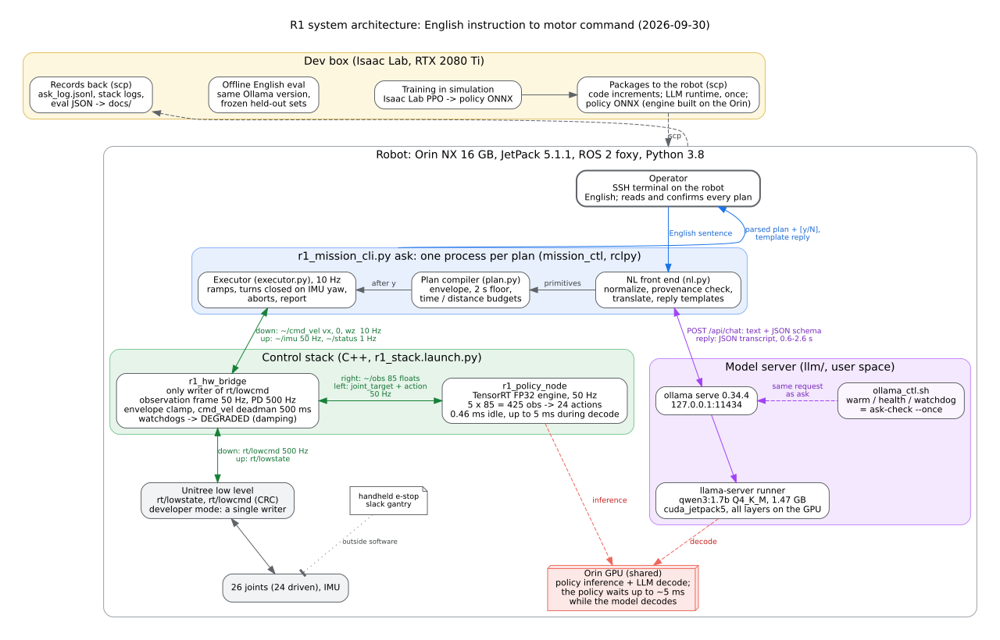

# R1process

A walking policy for the **Unitree R1** humanoid, taken from simulation to the real robot,
and then given an English command line:

- **Train** (Isaac Lab, PPO): a proprioceptive velocity-tracking policy, 425-dim
  observation → 24 joint targets at 50 Hz.
- **Deploy** with no external computer: ONNX → TensorRT on the robot's own Jetson Orin NX,
  driven by a C++/ROS 2 hardware bridge. It walks untethered and recovers from pushes
  ([video](docs/w07_walk_push_recovery.mp4)).
- **Measure the sim2real gap** on one knob, actuator stiffness `kp_scale`. The simulator
  predicts stable walking from ×0.80 to ×2.00+, the robot manages ×1.10–1.50, and the
  difference is posture, not joint tracking ([figure](docs/stageA_kp_sweep.png)).
- **Command it**: `mission_ctl` turns "walk 3 s, turn left 90°" into a checked plan, and
  `ask` accepts the same in English through a small local model (qwen3:1.7b) on the
  robot. The model only transcribes; deterministic code judges, and the operator confirms.



*The whole system: an English sentence is turned into a plan once, before the robot
moves; below that, the bridge, the policy and the motors run at 10 / 50 / 500 Hz with
their own safety checks. Details and the logic diagram: [docs/system_architecture.md](docs/system_architecture.md).*

## Quick start

Pick the row that matches what you have. Everything in the first two rows runs on any
machine with Python 3.8+, with no GPU, no ROS and no robot.

| you want to… | do this | time |
|---|---|---|
| **understand the project** | read [docs/technical_report.md](docs/technical_report.md) (the whole project in one document), then [docs/system_architecture.md](docs/system_architecture.md) (how a sentence becomes motor commands) | 30 min |
| **run something now** | the commands below | 2 min |
| **train or evaluate in simulation** | an NVIDIA GPU with Isaac Lab 2.1 / Isaac Sim 4.5 → [*Reproducing*](#reproducing) and [*Reproducing a training run*](#reproducing-a-training-run-fr-t6) | 1 h to set up, 1.5 h per training run |
| **run it on an R1** | an R1 EDU (onboard Orin NX) → [deploy/README.md](deploy/README.md), then [mission_ctl/README.md](mission_ctl/README.md) and [llm/README.md](llm/README.md); read [*Running on the robot*](#running-on-the-robot) first | a day |

```bash
git clone https://github.com/kedianwen/LDRQ.git && cd LDRQ

# the command layer and policy packaging: unit tests (~2 s, standard library only)
python3 mission_ctl/tests/test_core.py | tail -1        # pass 106  fail 0
python3 mission_ctl/tests/test_nl.py   | tail -1        # pass 132  fail 0
python3 llm/coexist.py --selftest      | tail -1        # selftest: OK
bash policy_pack/tests/run_tests.sh    | tail -1        # pass 12  fail 0

# what the robot says it can do, generated from the deployed configuration
python3 mission_ctl/r1_mission_cli.py capability

# a plan, compiled, checked and simulated against a stand-in robot; nothing moves
python3 mission_ctl/r1_mission_cli.py run "walk 3s@0.3; turn left 90" --dry-run
```

To try the English front end as well, run [Ollama](https://ollama.com) with
`ollama pull qwen3:1.7b`, then
`python3 mission_ctl/r1_mission_cli.py ask "walk forward for 3 seconds, then turn left" --dry-run`.
It prints the parsed plan, or the reason it refuses.

## How the project was organised

The work followed a 12-week plan, **W01–W12**, in three milestones, **M1–M3**. On
2026-09-26, after W08, the last four weeks were replaced by four **stages, A–D**, because
dropping INT8 quantisation (see below) made the original W09–W12 describe a different
project. Code, commits and documents refer to work by week or stage:

| period | milestone | what was built | where it lives |
|---|---|---|---|
| **W01** (closed 2026-08-12) | M1 training | robot model: URDF → USD, Isaac Lab config, joint and mass checks, GPU throughput | `assets/`, `scripts/` |
| **W02** (08-14) | M1 | the gym task, standing still | `tasks/r1_flat/` |
| **W03** (08-15) | M1 | rewards, first real gait, gait diagnostics | `tasks/`, `scripts/diagnose_gait.py`, `experiments/` |
| **W04** (08-19) | M1 | domain randomisation, observation history, hardware-spec actuators; **the deployed policy** | `models/week04_nohead/`, `experiments/` |
| **W05** (08-26) | M2 deployment | ONNX → TensorRT on the Orin, numerical parity | `deploy/` |
| **W06** (09-23) | M2 | C++/ROS 2 hardware bridge, watchdog, first walk under a gantry | `deploy/ros2_ws/` |
| **W07** (09-24) | M2 | walking and push recovery on the real robot; measurement tools | `deploy/tools/` |
| **W08** (09-28) | M2 | INT8 evaluated and dropped; 60 s untethered walk | [docs/int8_waiver.md](docs/int8_waiver.md) |
| **Stage A** (09-29) | M3 robustness | the `kp_scale` sweep, sim and real on one axis; report; reproducible repo | [docs/stageA_kp_sweep.md](docs/stageA_kp_sweep.md), [docs/technical_report.md](docs/technical_report.md) |
| **Stage B** (09-30) | M3 command layer | `mission_ctl`: walk by time, turn by angle, abort paths, on the robot | `mission_ctl/` |
| **Stage C** (09-30) | M3 | English instructions through a local model on the Orin | `mission_ctl/r1_mission/nl.py`, `llm/` |
| **Stage D** | M3 | swap the policy with one command | `policy_pack/` (written and tested, not yet run on the robot) |

The plans themselves, the lab notebook and the step-by-step guides used at the robot
are kept outside this repository. Everything a reader needs from them is restated here
and in `docs/`. Three traces of them remain:

- **Requirement IDs.** `PG-n` is a project gate (what "done" means, e.g. PG-1 tracking
  error ≤ 0.15 m/s in simulation, PG-2 60 s of continuous walking on the robot). `FR-xn`
  is a functional requirement: T training, Q quantisation/inference, D deployment,
  R robustness. `RK-n` is a risk item. All gates and requirements, each with its status
  and evidence: [docs/dod.md](docs/dod.md). **"Plan 3.6"** is the stage C plan's
  coexistence criterion: while the language model runs on the shared GPU, policy
  inference p99 ≤ 2 ms and setpoint lag p95 ≤ idle + 1 ms
  ([docs/system_architecture.md](docs/system_architecture.md#the-shared-gpu-decision-2026-09-30)).
- **`~/kdw/...` paths** in a few code comments point at that private notebook. The
  finding each one cites is summarised next to it.
- **`experiments/*/NOTES.md`** are the original lab notes, in Chinese. Each run is
  summarised in English in [experiments/README.md](experiments/README.md), and the
  lessons are in [*What each week produced*](#what-each-week-produced) below.

## Status

**The 12-week scope and stages A–C are closed (2026-09-30).** Stage D is next. All
videos are recorded at the end of the project. In short: the policy walks on the real
robot, untethered for 60 s, and recovers from pushes; the sim2real gap is measured on one
knob; the robot follows English instructions through a model running on its own GPU.

| Milestone | Span | Verdict |
|---|---|---|
| M1 · training | W01–W04 | **passed** 2026-08-19 — PG-1 met with 4x margin |
| M2 · deployment | W05–W08 | **met** — PG-2 60 s untethered (video being archived), parity 1.335e-05 on the Orin, FR-Q3 (INT8) waived with evidence, FR-Q4 at FP32/FP16 |
| M3 · robustness + command layer | stages A–D | **A, B, C done** (videos at the end); D written and self-tested, awaiting the robot |

| Stage | What it delivers | State |
|---|---|---|
| **A** | `kp_scale` stability domain (sim curve + real points on one axis, same command sequence on both sides), PG-2 evidence, report/repo/video/DoD. The speed calibration was dropped on 2026-09-28: ground speed is taken as equal to the command | **done** except the PG-2 video: sim 0.80–2.00+ vs real **1.10–1.50** (both edges bounded: the trained 1.00 passed once and failed once on an 80 ms tilt spike; 1.60 was emergency-stopped on audible joint noise). Report, INT8 waiver, DoD in `docs/`; demo assembled except the PG-2 clip |
| **B** | `mission_ctl/` on the robot: walk for a time, turn to an angle, walk an (open-loop) distance at the commanded speed. Demo at `kp_scale` 1.2 / 1.3, the middle of the real domain | **done** 2026-09-30 except the video. Turn response on the spot at kp 1.0/1.2/1.3: every rate 0.15–0.5 rad/s turns at ~0.8 of the command; a small yaw rate is lost *while walking*, so the robot turns on the spot only ([docs/stageB_turn_response.md](docs/stageB_turn_response.md)). At kp 1.3: 10 closed-loop turns and the demo sequence all DONE, 0 timeouts, within 1.6° by the IMU; abort paths 4/4 (Ctrl-C, `kill -9` → deadman, DEGRADED, no stack) ([docs/stageB_mission_runs.md](docs/stageB_mission_runs.md)). By decision, turn angle is the IMU reading and speed is the command |
| **C** | LLM command layer: **English** instruction → schema-constrained JSON → deterministic checks → execution → templated report | **done** 2026-09-30 except the video. `mission_ctl ask`: the model transcribes, deterministic code judges (units normalised first; every distance, time and angle must have been said; refusals from the deployed envelope; all or nothing), the operator confirms the parsed plan, the reply is a template. Offline eval of 7 small models on three held-out sets frozen in turn: **qwen3:1.7b 75/80 clean**, 100 % valid JSON. **On the Orin** (Ollama 0.34.4 for JetPack 5): the same 77/80 as the dev box, 0.65 s p50; 11 instructions end to end, all executed or refused as asked. The model stays on the GPU by decision: it holds the policy's inference at ~5 ms, inside every control-loop limit but above plan 3.6's 2 ms target, which is the optimisation goal. **Each `ask` stands alone** ([docs/stageC_nl_eval.md](docs/stageC_nl_eval.md)) |
| **D** | `policy_pack/` on the robot: swap a policy with one command | code written and self-tested, awaiting the robot |

## Layout

| folder | what it is | built in | start with |
|---|---|---|---|
| `assets/` | the R1 robot definition: URDF, meshes, Isaac Lab `ArticulationCfg`; the USD is generated, not tracked | W01–W04 | [assets/r1/README.md](assets/r1/README.md) |
| `tasks/` | the flat-ground velocity-tracking task `Isaac-Velocity-Flat-R1-v0`: scene, observations, rewards, randomisation, PPO config | W02–W04 | [tasks/r1_flat/README.md](tasks/r1_flat/README.md) |
| `scripts/` | Isaac Lab tools: URDF→USD, inspection, train/play/evaluate, gait diagnosis, config-drift check, the simulated `kp_scale` sweep, figures, demo video | W01 → stage A | [scripts/README.md](scripts/README.md) |
| `experiments/` | one record per training run (config + final metrics), for comparing runs | W03–W04 | [experiments/runs.md](experiments/runs.md) |
| `models/` | **the deployed policy** (checkpoint, TorchScript, ONNX, parity fixture), so a fresh clone needs no retraining | W04, tracked in stage A | [models/week04_nohead/README.md](models/week04_nohead/README.md) |
| `deploy/` | the on-robot runtime: TensorRT engine builder and parity check, the C++/ROS 2 policy node and hardware bridge, measurement probes | W05–W08 | [deploy/README.md](deploy/README.md) |
| `policy_pack/` | swap the deployed policy with one command: bundle on the dev box, eight checked install steps on the robot | stage D | [policy_pack/README.md](policy_pack/README.md) |
| `mission_ctl/` | the command layer: time / angle / speed plans over the bridge's topics, IMU-closed turns, `ask` for English, and its offline eval | stages B–C | [mission_ctl/README.md](mission_ctl/README.md) |
| `llm/` | the model server on the robot: Ollama for JetPack 5, health checks, the control-loop coexistence test | stage C | [llm/README.md](llm/README.md) |
| `docs/` | results: the technical report, per-stage write-ups, figures, robot evidence | all | [docs/README.md](docs/README.md) |

`kdw_deploy.tar.gz` at the top level is the snapshot of the robot's deploy tree from
W07 (`~/kdw_deploy` on the robot), including the Orin-built binaries. It is kept because
it is the base every later on-robot update was layered on; see
[*Running on the robot*](#running-on-the-robot).

## Running on the robot

What a reader with an R1 needs to know before anything moves. Each item cost a session
when it was missed:

1. **Switch the robot to developer mode first.** Otherwise the factory controller keeps
   writing `rt/lowcmd` against ours, and the result looks like a sim2real gap
   (`deploy/tools/probe_cpp/probe_lowcmd` checks for a second writer).
2. **Build the TensorRT engine on the Orin and pass `r1_parity_check` there**, every
   time. Engines are not portable, and a wrong engine runs at full speed with no error.
3. **Use a gantry** for the first runs, and keep the e-stop in reach. The bridge's output
   is off by default (`enable_output:=false`).
4. **Write numeric launch arguments as floats** (`kp_scale:=1.3`, `min_control_rate_hz:=55.0`);
   an integer kills the bridge at start-up.
5. **Lock the clocks before measuring latency** (`deploy/tools/w08_preflight.sh --lock-clocks`).
6. **Copy code to the robot as `.tar.gz`, not `.zip`**: a zip drops the execute bits.

The robot runs JetPack 5.1.1, TensorRT 8.5.2, ROS 2 foxy and Python 3.8, all different
from the training machine; see [*Hardware target*](#hardware-target).

## What each week produced

Closed weeks, with the finding from each that was not visible in any metric.
That column is the useful one: on this project almost every real defect has been
silent — the chain reports success and returns a plausible wrong answer.

| Week | Delivered | What was not obvious |
|---|---|---|
| **W01** · environment + asset | URDF→USD conversion, `ArticulationCfg`, joint/limit verification, 2080 Ti throughput sweep. Closed 2026-08-12. | R1 is the **EDU** version with an onboard Orin NX, so deployment needs no external compute board — this set the whole M2 plan. |
| **W02** · task skeleton + standing | `tasks/r1_flat/` as a standalone package registering `Isaac-Velocity-Flat-R1-v0`, observations split policy/critic for asymmetric AC, static standing ≥10 s. Closed 2026-08-14. | Standing needed **`sim dt=0.002`**, not more gain tuning. At the default step the contact solve could not hold a 26-DoF biped, and that reads as a tuning problem. (The real cause was gains far stiffer than the hardware's; after W04 corrected them, `dt=0.005` was stable again.) |
| **W03** · rewards + first training | First real alternating gait (`touchdown_gate`), plus `scripts/diagnose_gait.py` (per-foot air-time fraction + FFT phase). Closed 2026-08-15. | **`feet_air_time_positive_biped` is maximised by never stepping.** One foot planted and the other permanently airborne is that term's global optimum, so the policy learned single-leg support. Three reward rounds missed it; the diagnostic script found it in one. |
| **W04** · DR + M1 gate | Domain randomisation, observation history, hardware-spec actuators, command curriculum, symmetry augmentation; head not actuated → **24-dim action / 425-dim observation**. Final run `2026-08-19_11-03-32_week04_nohead`. **M1 passed** — PG-1 worst 0.037 m/s against a 0.15 threshold. | A config *dump* is weaker than a spec: it records what happened without checking the code still produces it. `scripts/verify_repro.py` turns the dump into a contract the repo is tested against. |
| **W05** · ONNX → TensorRT on the Orin | Engine builder, parity checker, C++/ROS 2 runner, running on the robot's own Orin NX. **FR-Q1 passed on target hardware: `max_abs = 1.335e-05`** against a 1e-3 gate; 50 Hz closed loop, `failures=0`, inference 2.45% of the control budget. | Numerics held across **three simultaneously different dimensions** — Turing→Ampere, TensorRT 10.7→8.5.2, ROS 2 humble→foxy — which is far stronger evidence than a dev-box pass. Separately, pinning the clocks tightened the latency tail **11x**, so any unpinned timing number is a lottery. |
| **W06** · C++/ROS 2 node + hanging dry run | Hardware bridge, watchdog, fault injection, 7/7 exit criteria. The robot walks under protection. | Two defects that produced **no error anywhere**: (1) **`--fp32` was never fp32** — TensorRT enables `kTF32` by default, rounding GEMM inputs to a 10-bit mantissa (FP16's width), and because the flag only *permits* TF32 the choice is made by build-time kernel timing, so the same command passed once at 1.144e-05 and failed later at 1.095e-02 on the same machine and ONNX. (2) **PD gains are per joint**, six groups, not one scalar — an export omission left the legs undamped and the head vibrating. |
| **W07** · walking on the real robot | Walking in developer mode with push recovery. Setpoint-lag instrumentation in the bridge, stance attribution tooling. | **Developer mode is a second writer problem.** Without switching the handheld first, the factory motion service keeps writing `rt/lowcmd` at 500 Hz against us; the symptoms — torso sway, joint grinding, tremor, stance not held — all look exactly like a sim2real gap, and cost a full session. Two measurements then *cancelled* planned work: setpoint lag is **1.3 ms = 0.065 control steps** against a trained range of {0,1} steps, so no delay compensation; and **FP16 buys nothing** (1.717e-05, FP32's order, and 171 µs, not faster) because at batch 1 this 90k-parameter MLP is kernel-launch bound and the builder keeps FP32 kernels. Narrow stance was attributed to the hardware side with saturation ruled out arithmetically — 6.45 N·m against a 60 N·m rating, 10.8%. |

**W08 — and why INT8 was cut.** The week was planned around INT8
PTQ, a three-layer behavioural acceptance and a FP32/FP16/INT8 benchmark. It was
closed as a *conclusion* rather than as unfinished work, on three
independent measurements:

1. **It cannot buy time.** This policy is 90,648 parameters at batch 1, so a step
   is ~180 kFLOP — a fraction of a microsecond of arithmetic — against 70 µs measured
   on the Orin: over 99% of a step is kernel launch overhead. FP16 measured 1.717e-05 (FP32's order) and 171 µs (not
   faster), because `kFP16`/`kINT8` *permit* rather than require, and TensorRT
   picked FP32 kernels by build-time timing.
2. **It cannot buy space.** FP16 made the engine **51.1% larger**
   (966,887 → 1,461,299 B): the arithmetic saving does not cover the extra
   reformat layers and duplicated weights.
3. **The calibration set is not defensible.** The observation is five stacked
   frames (80% overlap between neighbours), so 60 s of single-speed straight
   walking is one operating point and ~72 gait cycles; covering the vx×wz grid
   needs several real walking segments, which did not exist when the decision
   was made.

So FR-Q3 is recorded as *waived with evidence* and FR-Q4 as *satisfied at two
precisions*. A related finding kept from the same week: the plan's closed-loop
gate was **not executable as literally written**, because a TensorRT plan is not
portable — the engine exists only on the Orin and the simulator only on the dev
box.

M3 keeps FR-R2's methodology — one controlled, physically real perturbation,
swept in simulation and spot-checked on the robot — and changes the knob to
**`kp_scale`**, the actuator-gain error. That knob is already a launch argument
on the robot, it is one of the five domain-randomisation items, and unlike INT8
it actually moves the metrics. Because the same knob sweeps on both sides, one
figure settles FR-R2/PG-5 (the curve) and FR-R4/PG-6 (the offset between the
curve and the real points) at once.

## Reproducing

What each result needs, and the command that regenerates it. "GPU" means the Isaac Lab
dev box below; "robot" means an R1 with the `deploy/` stack; "none" runs on any machine
with Python 3.8+.

**Once after cloning (GPU):** the robot's USD is a build artefact, not tracked —
generate it from the URDF before any Isaac Lab script, or every one of them fails with
`USD file not found ... assets/r1/usd/R1.usd`:

```bash
conda activate env_isaaclab
~/IsaacLab/isaaclab.sh -p scripts/convert_r1_urdf.py --headless
```

The conversion is done once it prints `[INFO] USD articulation has 26 joints:` and the
joint list (about a minute); on this machine Isaac Sim's shutdown can then spin for many
minutes. `assets/r1/usd/R1.usd` is already written at that point, so Ctrl-C is safe.
Also note that `isaaclab.sh` exits 0 even when the Python script raised, so check the
output (each script prints `[ok]` lines or writes its report), not the exit code.

| result | needs | command |
|---|---|---|
| unit tests: command layer, policy packaging | none | `python3 mission_ctl/tests/test_core.py` · `python3 mission_ctl/tests/test_nl.py` · `python3 llm/coexist.py --selftest` · `bash policy_pack/tests/run_tests.sh` |
| stage A figure, from the committed data | none (matplotlib) | `python3 scripts/plot_gain_sweep.py --sim docs/stageA_kp_sweep_sim.json --real docs/stageA_kp_sweep_real.json --out docs/stageA_kp_sweep.png` |
| training config still matches the deployed run | GPU | `~/IsaacLab/isaaclab.sh -p scripts/verify_repro.py --headless --run 2026-08-19_11-03-32_week04_nohead` |
| PG-1 tracking table | GPU | `~/IsaacLab/isaaclab.sh -p scripts/eval_baseline.py --headless --num_envs 64 --checkpoint models/week04_nohead/model_2999.pt` |
| simulated half of the `kp_scale` sweep | GPU (~3 min) | `~/IsaacLab/isaaclab.sh -p scripts/sweep_gain_robustness.py --headless` |
| simulation clip for the demo | GPU | `~/IsaacLab/isaaclab.sh -p scripts/record_demo_sim.py --headless --out outputs/demo/sim_sequence.mp4` |
| demo video | none (ffmpeg) | `python3 scripts/make_demo_video.py --out ... --clip ... --figure docs/stageA_kp_sweep_wide.png` (see its docstring) |
| retrain the policy | GPU (~1.5 h) | see *Reproducing a training run* below |
| engine + parity on the robot | robot | `deploy/README.md` *Quick start* |
| real half of the `kp_scale` sweep | robot | `python3 deploy/tools/probe_cpp/gain_sweep_real.py --plan`, then `--record <KP>` per point, then `--collect` |

**Not in git, deliberately:** training logs (`logs/`, several GB — the deployed run's
artefacts are in `models/` instead), TensorRT engines (not portable; rebuilt on each
target), and the raw real-robot recordings (~80 MB; the reduced per-recording metrics are
`docs/stageA_kp_sweep_real.json`).

## Environment

Isaac Lab 2.1.0 + Isaac Sim 4.5.0 + torch 2.5.1+cu118, conda env `env_isaaclab`.
All scripts run through `~/IsaacLab/isaaclab.sh -p ...` from this directory (the
project root) — see each script's docstring/header for the exact invocation.

## Reproducing a training run (FR-T6)

Everything needed to reproduce a run is pinned: the seed is set explicitly in
`tasks/r1_flat/agents/rsl_rl_ppo_cfg.py` (not inherited from an rsl_rl default),
and Isaac Lab dumps the fully-resolved configs to
`logs/rsl_rl/r1_flat/<run_id>/params/{env,agent}.yaml` at launch. Each archived
run in `experiments/<run_id>/` keeps those configs plus a `pip freeze` snapshot.

**Where the hyperparameters actually live.** They are Python dataclasses
(`tasks/r1_flat/flat_env_cfg.py`, `.../agents/rsl_rl_ppo_cfg.py`), and the
`params/*.yaml` beside each run are a *dump* of the resolved config — editing
that yaml changes nothing. This is Isaac Lab's design, and it keeps type
checking and IDE navigation over the config, but on its own a dump is weaker
than a spec: it records what happened without anything checking that the code
still produces it.

`scripts/verify_repro.py` closes that. It rebuilds the config from current code
and diffs it field by field against a run's archived yaml, so the dump becomes a
contract the repository is tested against:

```bash
~/IsaacLab/isaaclab.sh -p scripts/verify_repro.py --headless \
    --run 2026-08-19_11-03-32_week04_nohead
# RESULT: PASS -- current code reproduces this run's configuration exactly
```

It exits non-zero on drift and writes `experiments/<run_id>/repro_check.txt`.
Fields that vary per invocation (env count, device, run name) are reported
separately from real drift, and values the scene resolves at construction time
(`{ENV_REGEX_NS}` placeholders, terrain env count/spacing) are normalised rather
than ignored. Run it against a superseded run to see it work: `week04_hwspec`
reports exactly the two fields the head removal changed.

```bash
conda activate env_isaaclab

# train (Week04 final config: hardware-spec actuators + obs history +
# domain randomization + command curriculum + symmetry augmentation, head not
# actuated -> 24-dim action, 425-dim policy observation).
# A single run -- the command curriculum counts env steps, so splitting this
# into train-then-resume shifts the ramp and does not reproduce the same curve.
~/IsaacLab/isaaclab.sh -p scripts/train_r1.py --headless \
    --num_envs 4096 --max_iterations 3000 --run_name week04_nohead

# watch it
tensorboard --logdir logs/rsl_rl/r1_flat

# evaluate: PG-1 tracking table, then per-foot gait statistics
~/IsaacLab/isaaclab.sh -p scripts/eval_baseline.py --headless --num_envs 64 \
    --checkpoint logs/rsl_rl/r1_flat/<run_id>/model_2999.pt
~/IsaacLab/isaaclab.sh -p scripts/diagnose_gait.py --headless --num_envs 32 \
    --checkpoint logs/rsl_rl/r1_flat/<run_id>/model_2999.pt

# archive config + final metrics into experiments/
python scripts/archive_run.py <run_id>
```

`--resume` re-interprets `--max_iterations` as an *absolute* target rather than
an additional count — see `scripts/train_r1.py`'s docstring.

## Hardware target

R1 is the **EDU version** with an onboard 8-core Jetson Orin NX (40-100 TOPS), so
the policy runs on the robot itself with no external compute board.

The robot's software stack is **not** this dev box's, and every difference has
bitten at least once: JetPack 5.1.1, **TensorRT 8.5.2**, **ROS 2 foxy**, CUDA
11.4, and `unitree_hg` messages. A TensorRT `.plan` is tied to the TensorRT
version, GPU architecture and driver that built it, so **the artefact that ships
to the robot is the ONNX, and the engine is built on the Orin**. `deploy/` keeps
both toolchains working from one tree; see `deploy/README.md`.
