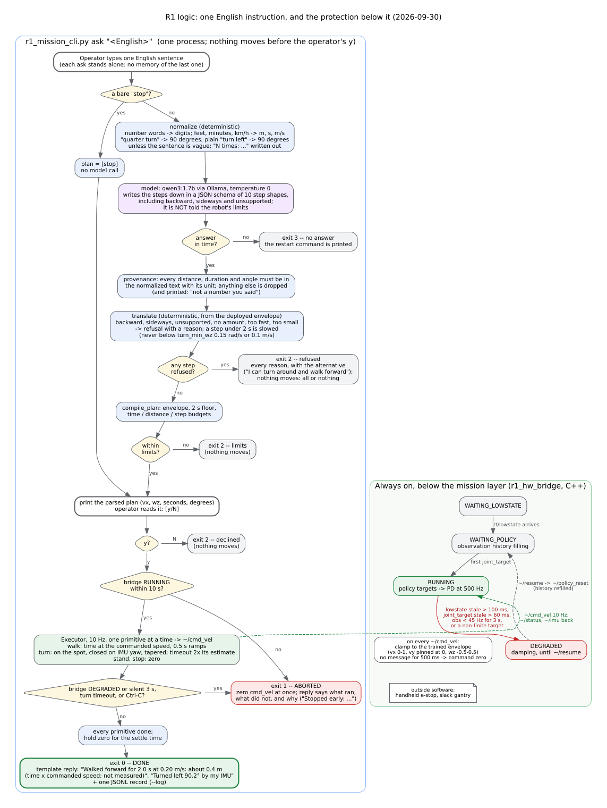

# System architecture: the LLM command layer and motion control (2026-09-30)

**The system in one sentence.** An operator types one English sentence on the robot. A
local model writes it down as JSON, and deterministic code decides whether and how the
robot moves. The operator confirms the parsed plan. A 10 Hz executor then steers the 50 Hz
policy through the bridge, the only process that writes the 500 Hz motor commands. The
reply is a template.

The model never enters the control loop. It runs once per instruction, before anything
moves. It cannot publish a topic. It never reports what happened.

This page describes the system as deployed and measured on 2026-09-30:
- stage B: the command layer (`mission_ctl/`) on the robot;
- stage C: the English front end (`nl.py`) and the model server (`llm/`).

The numbers come from [stageC_nl_eval.md](stageC_nl_eval.md) and
[stageB_mission_runs.md](stageB_mission_runs.md).


*Figure 1. Processes, channels and rates. Source:
[system_architecture.dot](system_architecture.dot).*

## Four timescales

| layer | runs | rate or latency on the robot | code |
|---|---|---|---|
| model: qwen3:1.7b via Ollama 0.34.4 | once per instruction, before anything moves | 0.6–2.6 s per instruction at 33.5 tok/s on the GPU | `llm/`, llama.cpp (CUDA 11.4) |
| NL front end + plan compiler | once per instruction | milliseconds | `mission_ctl/r1_mission/nl.py`, `plan.py` (Python 3.8) |
| executor | while a plan runs | `~/cmd_vel` at 10 Hz | `executor.py`, `node.py` (rclpy) |
| policy | always | 50 Hz; 0.46 ms idle, up to ~5 ms while the model decodes | `deploy/.../r1_policy_runner` (C++, TensorRT FP32) |
| bridge | always | observation 50 Hz, PD to `rt/lowcmd` 500 Hz | `deploy/.../r1_hw_bridge` (C++) |

## One instruction, step by step

1. **The operator runs** `r1_mission_cli.py ask "<English>"` in an SSH terminal on the
   robot. A bare "stop" skips the model.
2. **`normalize()`, deterministic.**
   - Number words become digits.
   - Feet, minutes and km/h become m, s and m/s. "A quarter turn" becomes 90 degrees.
   - A plain "turn left" becomes 90 degrees, unless the sentence is vague.
   - "N times: ..." is written out in full.
3. **The model writes the steps down.**
   - The request is an HTTP POST to `127.0.0.1:11434/api/chat`. It carries the pinned
     prompt `c0c08d6816ca` (instructions, 7 examples and the normalized sentence) and a
     JSON schema of 10 step shapes. The shapes include backward, sideways and
     `unsupported`.
   - Settings: temperature 0, seed 0, 2048-token context, thinking off.
   - The runner decodes on the Orin GPU. The model is not told the robot's limits, so it
     cannot bend a request to fit them.
4. **Provenance, deterministic.** Every distance, duration and angle must appear in the
   normalized sentence with its unit. Anything else is dropped, and the drop is printed.
5. **`translate()`, deterministic.** The deployed envelope decides every refusal and its
   reason: backward, sideways, unsupported, no amount, too fast, too small.
   - A step under 2 s is slowed, but never below `turn_min_wz` (0.15 rad/s) or 0.1 m/s.
   - One refused step refuses the whole plan.
6. **`compile_plan()`** is the same compiler as `run`: envelope, the 2 s floor, and the
   time, distance and step budgets.
7. **The parsed plan is printed** (vx, wz, seconds, degrees), and the operator answers
   `[y/N]`. `ask` has no `--yes`.
8. **The executor waits for the bridge's `RUNNING`, then steers.** It publishes
   `/r1_hw_bridge/cmd_vel` `[vx, 0, wz]` at 10 Hz.
   - A walk is timed at the commanded speed.
   - A turn is on the spot, closed on the IMU yaw from `/r1_hw_bridge/imu`.
   - It follows `/r1_hw_bridge/status` and aborts if the bridge degrades or goes silent,
     a turn times out, or the operator presses Ctrl-C.
9. **The bridge clamps every command** to the trained envelope. A command older than
   500 ms decays to zero.
   - The command becomes the velocity-command slot of the 85-float observation frame:
     angular velocity 3, projected gravity 3, command 3, joint positions 26, joint
     velocities 26, last actions 24.
   - The frame goes out on `/r1_hw_bridge/obs` at 50 Hz.
10. **The policy stacks five frames** (425 floats) and runs the TensorRT engine.
    - It publishes 24 joint targets on `/r1_policy_node/joint_target` (default pose + scale
      × action).
    - It publishes the raw action on `/r1_policy_node/action`, which goes into the next
      frame.
11. **The bridge turns the targets into PD commands** with per-joint gains × `kp_scale`
    (1.3 in the demos). It writes `rt/lowcmd` at 500 Hz, with CRC, over the Unitree SDK's
    DDS. Joint state and the IMU come back on `rt/lowstate`.
12. **The executor's report becomes a template reply.** Examples: "Walked forward for 2.0 s
    at 0.20 m/s: about 0.4 m (time x commanded speed; not measured)" and "Turned left 90.2°
    by my IMU". With `--log`, one JSONL record is written.



*Figure 2. The decisions of one `ask`, with the exit code of every way out. On the right
is the bridge's state machine, which runs whether or not a plan does. Source:
[system_logic.dot](system_logic.dot).*

## Channels

| channel | from → to | payload | rate | notes |
|---|---|---|---|---|
| `127.0.0.1:11434/api/chat` | mission process → Ollama | normalized sentence + JSON schema → JSON transcript | per instruction | loopback only; `ollama_ctl.sh health` sends the same request (`ask-check --once`) |
| `/r1_hw_bridge/cmd_vel` | mission process → bridge | `[vx, vy, wz]` | 10 Hz | clamped to vx 0–1, vy 0, wz ±0.5; 500 ms deadman; one writer (the mission node refuses to be a second) |
| `/r1_hw_bridge/imu` | bridge → mission process | quaternion (w, x, y, z), ... | 50 Hz | best effort: a default (reliable) subscriber gets nothing |
| `/r1_hw_bridge/status` | bridge → mission process | state name first | 1 Hz | reliable + transient local, so a new subscriber gets the state at once |
| `/r1_hw_bridge/obs` | bridge → policy | 85 floats | 50 Hz | best effort, keep last 1 |
| `/r1_policy_node/joint_target`, `/action` | policy → bridge | 24 + 24 floats | 50 Hz | a non-finite target, or none for 60 ms, degrades the bridge |
| `/r1_hw_bridge/resume` → `/policy_reset` | operator → bridge → policy | Bool, then Empty | by hand | leaves DEGRADED; the policy refills its history |
| `rt/lowstate`, `rt/lowcmd` | Unitree low level ↔ bridge | `unitree_hg` LowState / LowCmd (CRC) | lowcmd 500 Hz | SDK DDS; developer mode, or the factory service is a second writer; state older than 100 ms degrades the bridge |

## Where each check lives

| layer | check | what it catches |
|---|---|---|
| `normalize()` | units and number words to digits | the model never has to convert units |
| JSON schema | 10 closed step shapes | invalid output: 100 % valid JSON in every run, 280/280 on the robot |
| provenance | every amount must have been said, with its unit | invented numbers: "Do that again." is refused, not guessed |
| `translate()` | backward, sideways, unsupported, no amount, too fast, too small | requests the robot cannot do, each with its reason |
| `compile_plan()` | envelope, 2 s floor, budgets | plans outside the trained range, or too long |
| **the operator** | reads the parsed plan, `[y/N]` | a legal plan that is not what was asked, the one error no limit can catch; also a guessed direction |
| executor | bridge state, no IMU within 2 s, turn timeout, Ctrl-C | a plan that cannot finish, a bridge fault |
| bridge | envelope clamp, 500 ms deadman, watchdogs to DEGRADED | a dead mission process, a stalled or broken policy, a slow loop, lost motor state |
| outside software | handheld e-stop, gantry | everything else |

## The shared GPU (decision 2026-09-30)

The Orin NX has one GPU. The policy's TensorRT engine and the model share it.

- **While the model decodes, the policy waits for the GPU.** Its inference goes from
  0.46 ms to 3.5 ms at p50. It has a steady ceiling of about 5.0 ms, which looks like the
  GPU's time slice.
- **Against plan 3.6's targets** (inference p99 ≤ 2 ms, lag p95 ≤ idle + 1 ms), the GPU
  placement misses both. Four CPU threads meet both: 542 µs and 0.9 ms.
- **Against the limits the control loop actually has, the GPU is inside them:**
  - obs 50 Hz, no DEGRADED, no failed inference;
  - the slowest inference 5.4 ms of the 20 ms step;
  - the setpoint lag 5 ms, a quarter of the one step of lag the policy was trained with.

  The robot stood through two minutes of decoding and ran every `ask` with the model on
  the GPU.
- **Decision (user, 2026-09-30): the model stays on the GPU.** Plan 3.6's numbers become
  the target of follow-up optimization. This relaxes a criterion after the measurement, and
  it is recorded as such.
- `llm/coexist.py` reports both tiers. A broken limit fails the run (exit status 1); a
  missed target is reported, and the run still passes.

Follow-up optimization, in the order it would be tried:
1. **Keep decoding out of the motion windows.** `ask` already decodes before the plan
   starts. What remains is the optional watchdog's health check and an `ask` typed in a
   second terminal while a plan runs. Both can be made to wait until no plan runs.
2. **Take the policy off the GPU.** It is a 90,648-parameter MLP at batch 1, and the INT8
   analysis (W08) found that over 99 % of its GPU step is kernel launch overhead. A CPU
   implementation would remove the contention entirely, and probably be faster than
   0.46 ms. It changes the deployed numerics, so it needs its own parity check. This is a
   stage D-sized change.
3. **Give the policy's GPU context priority** (Tegra time-slice and runlist settings).
   This needs root on the robot, and it has not been investigated.
4. **Decode less:**
   - shorter JSON keys, which needs a new frozen held-out set before re-scoring;
   - or qwen3:0.6b: 54 tok/s instead of 33.5, but 73/80 instead of 77/80 on the Orin.

## What `ask` does not do

- **It has no memory.** Each instruction is read alone. Phrases that lean on an earlier one
  are refused, because the numbers the model fills in were never said. The exception is a
  direction: "turn the other way 90 degrees" executes as a guessed right turn, and the plan
  display is what catches it.
- **It has no arcs.** Walks and turns are separate primitives, and the robot turns on the
  spot only.
- **It measures no distance.** Distance is time × commanded speed, and the reply says so.
- **It uses no cloud.** The robot has no DNS or HTTPS route. The model runs on the robot.
- **It has no second model.** The Laya classifier path in the original plan was closed on
  2026-09-30 by the user's decision. It was never built into the system.

## Regenerating the figures

```bash
dot -Tsvg docs/system_architecture.dot -o docs/system_architecture.svg
dot -Tsvg docs/system_logic.dot -o docs/system_logic.svg
```

Graphviz 2.43, as on Ubuntu 20.04. In these files no edge in the same row crosses a
cluster boundary: 2.43 draws such edges twice, and aborts on a parallel pair.
