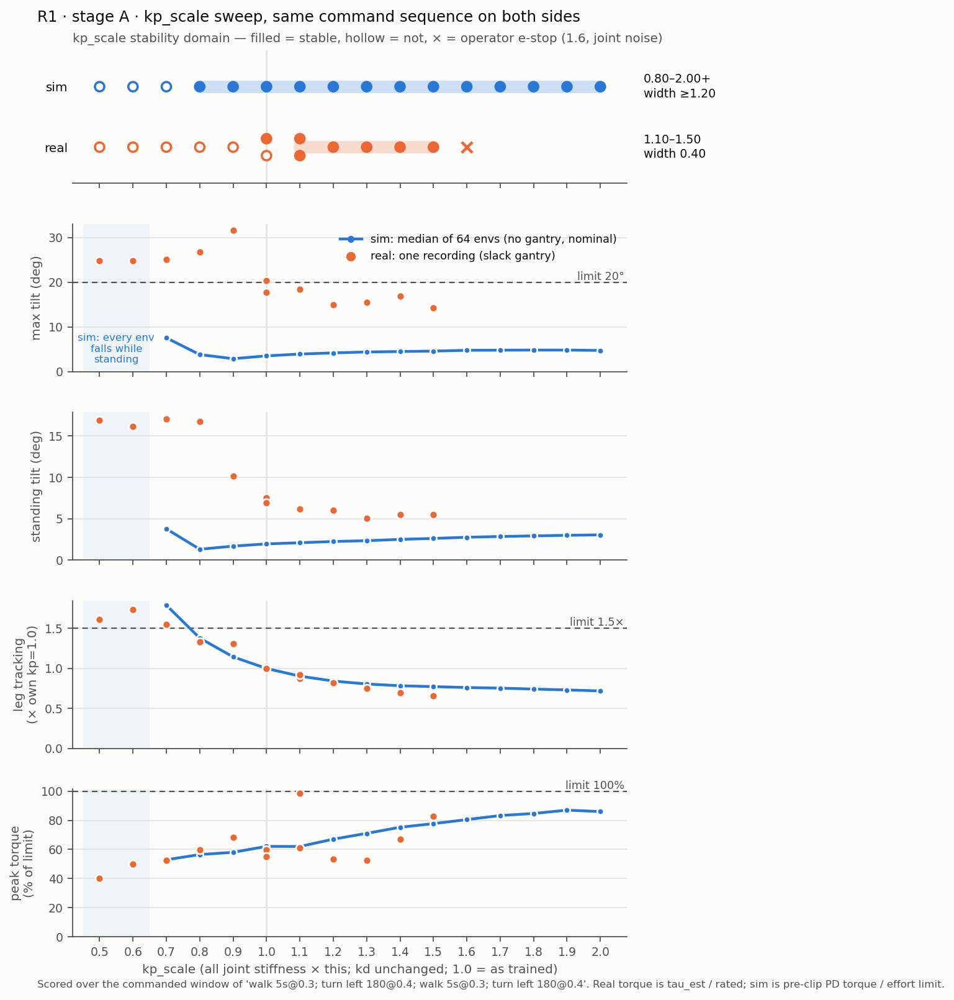

# Walking a Unitree R1 from Isaac Lab to its onboard Orin NX: a sim2real report, and how much actuator-gain error the policy really tolerates

*LDRQ technical report · 2026-09-29, updated 2026-10-02 with the English command layer and one-command policy install · code, data and figures: this repository*

## Abstract

We train a proprioceptive velocity-tracking walking policy for the Unitree R1 humanoid
(26 joints, 24 actuated by the policy) in Isaac Lab with PPO, an asymmetric actor-critic
and five-item domain randomization. The policy is deployed without an external computer:
ONNX → TensorRT on the robot's own Jetson Orin NX, driven by a C++/ROS 2 hardware bridge
at 50 Hz. It tracks forward speed to within 0.037 m/s in simulation (worst case over
0.3–1.0 m/s), reproduces the PyTorch reference on the robot to 1.3e-5, and walks
untethered for 60 s. We then ask one quantitative robustness question on both sides of
the gap — *how much actuator stiffness error does the policy tolerate?* — sweeping a
single gain multiplier `kp_scale` in simulation (16 gains × 64 envs) and on the robot
(11 gains, 13 recordings) under the identical command sequence and the identical
pre-registered stability definition. The simulator predicts a stable interval of
0.80–2.00+; the robot's is 1.10–1.50. The robot tolerates at most a third of the
predicted range, the trained gain sits on its lower edge, and the discrepancy is
postural — the real torso leans 2–5× more — while joint-level tracking scales as the
simulator predicts. Along the way, nearly every defect that cost time was *silent*:
the chain reported success and returned a plausible wrong answer. We list them.
Finally, the robot takes English instructions: a 1.7B-parameter model on the same Orin
transcribes a sentence into steps, and deterministic code checks them against the trained
command range before the operator confirms (77/80 on held-out sets on the robot). A
trained policy installs with one command that builds the engine on the robot and gates
on numerical parity.

## 1. Setup

**Robot.** Unitree R1 EDU: 26 joints (legs 2×6, waist 2, arms 2×5, head 2), onboard
8-core Jetson Orin NX, JetPack 5.1.1, TensorRT 8.5.2, ROS 2 foxy, `unitree_hg` messages.
The training box is an RTX 2080 Ti with Isaac Sim 4.5 / Isaac Lab 2.1 / ROS 2 humble —
every one of those differences mattered at least once (§5).

**Task.** Flat-ground velocity tracking, commands vx ∈ [0, 1.0] m/s, wz ∈ [−0.5, 0.5]
rad/s, vy pinned to 0, resampled every 10 s, 2 % standing envs.

**Policy.** MLP 425 → 128 → 128 → 128 → 24, ELU, 90,648 parameters. Observation:
base angular velocity, projected gravity, velocity command, joint positions and
velocities (relative), last action — 85 values per frame, 5-frame history. **No base
linear velocity**: the robot has no reliable estimator of it, so the actor never sees
it. The action is a per-group-scaled joint-position offset from the default pose for 24
joints; the head is deliberately not actuated (§5, W04). Joint PD runs in PhysX's implicit
drive (legs kp 100 / kd 2, ankles 40 / 2, …), matching the robot's firmware PD.

**Training.** rsl_rl PPO, 4096 envs, 24 steps/env, 3000 iterations (~295 M steps,
~1.5 h at 56 k fps), seed 42. Asymmetric actor-critic: the critic additionally sees base
linear velocity, contact wrenches and friction. Left-right symmetry augmentation on every
minibatch. Rewards: velocity tracking (exp), a swing/touchdown gait term (weight 10), and
physical-plausibility penalties (vertical velocity, orientation, height, torque,
acceleration, action rate, joint limits); a −200 termination penalty. Command curriculum
from [0, 0.5] m/s, no turning, to the full range. Domain randomization, five items:
friction 0.6–1.2, link mass ×0.9–1.1, actuator stiffness and damping ×0.85–1.15, pushes
of ±0.5 m/s every 10–15 s, and 0–1 control-step action delay.

**Deployment chain.** `policy.onnx` is the only artifact that travels; the TensorRT
engine is built on the Orin (a plan is tied to the TensorRT version, GPU architecture and
driver that built it) and must pass a parity check against a PyTorch fixture before the
node will load it. A C++ bridge assembles the observation from `rt/lowstate` at 50 Hz,
runs the policy node, and writes `rt/lowcmd` at 500 Hz with CRC, a watchdog, an
as-trained command-envelope clamp, a 500 ms command deadman and a DEGRADED state.

## 2. Simulation and deployment results

The first column names the project's pass/fail gate (PG-n) or requirement (FR-xn); all of
them are listed with their meaning in the
[top-level README](project_history.md#what-done-meant-gates-and-requirements).

| gate | measure | result |
|---|---|---|
| PG-1: speed tracking (sim) | worst mean \|vx − cmd\| over 0.3–1.0 m/s, 64 envs | **0.037 m/s** (threshold 0.15), 0 falls |
| FR-Q1: parity with PyTorch (robot) | max \|TensorRT − PyTorch\| over 512 fixture vectors | **1.335e-05** (gate 1e-3) |
| latency (robot) | inference in the 50 Hz loop | p50 ≈ 455 µs of a 20,000 µs budget (2.3 %) |
| closed loop (robot) | bridge health | obs 50.0 Hz, cmd 500.0 Hz, crc_fail 0, setpoint lag 0.6 ms (0.03 steps) |
| PG-2: 60 s walking (robot) | continuous walking, no gantry | **≥ 79.7 s** recorded 2026-09-29 ([pg2_untethered.md](pg2_untethered.md)); video at the end of the project |

Parity held across three simultaneous differences — Turing→Ampere, TensorRT 10.7→8.5.2,
humble→foxy — which is stronger evidence than any dev-box check. Six independent
implementations (onnxruntime, a hand-written numpy forward pass, TensorRT FP32/FP16 on
both GPUs) agree to 7.6e-6 – 1.5e-5. Locking the Orin's clocks tightened the latency tail
11×; unpinned timing numbers are not reported anywhere in this work.

**Quantization was dropped on measurement** ([int8_waiver.md](int8_waiver.md)): at
batch 1 a 90 k-parameter MLP is kernel-launch bound, FP16 was not faster and made the
engine 51 % *larger*, and a defensible INT8 calibration set would need many real walking
sessions for a gain the first two measurements rule out.

## 3. How much actuator-gain error does the policy tolerate?

**Why this question.** Actuator stiffness is where a learned walking policy meets the
hardware: real motors have compliance, friction and gear backlash the implicit PD in the
simulator does not. It is also a clean experimental knob — the bridge scales every joint's
kp by `kp_scale` at launch, the simulator can do exactly the same per environment, and
stiffness was one of the five randomized items (±15 %) in training.

**Protocol.** Both sides walk the same sequence — `walk 5 s at 0.3 m/s; turn left 180° at
0.4 rad/s; walk 5 s; turn left 180°` — generated by the same code (`mission_ctl`'s
Executor, 10 Hz, turns closed on IMU yaw). Metrics are computed over the commanded window
only. The stability definition was written down before any measurement: no DEGRADED (in
sim: no fall), torso tilt ≤ 20°, leg tracking rms ≤ 1.5× the kp = 1.0 point, torque
below its limit. A real gain is stable only if every recording at it passes; a simulated
gain if ≥ 95 % of its 64 envs do. The simulation runs the deployed network — the sweep
refuses to start unless the policy reproduces the robot's parity fixture (1.1e-5).

| | stable interval | width | what bounds it |
|---|---|---|---|
| simulation | 0.80 – 2.00+ | ≥ 1.20 | below: 0.7 fails tracking, ≤ 0.6 falls within 2 s of standing; above: nothing fails up to 2.0 |
| robot | **1.10 – 1.50** | **0.40** | below: 1.00 passed once and failed once (a 0.08 s tilt spike to 20.4°); above: 1.60 emergency-stopped on audible joint noise |

**Findings.**

1. **The robot tolerates at most a third of the simulated range** (0.40 vs ≥ 1.20), and
   the trained gain — central in simulation — sits on the robot's lower edge. The robot
   prefers gains 10–50 % stiffer than it was trained with.
2. **The gap is postural, not joint tracking.** Normalized to each side's kp = 1.0
   point, leg tracking error falls with stiffness in the same shape on both sides
   (within 0.11 from 1.0 to 1.5). Torso tilt does not agree at all: 5–17° standing and
   14–32° peak on the robot against 1–4° and 3–8° in simulation, and the real lean
   grows steeply below kp = 1.0 while the simulated one barely moves. Every real
   failure on the soft side is a tilt failure, a criterion the simulator never
   approaches. It is also visible before any command: standing lean alone scales with
   kp on the robot, which reads as gravity sag of a leg that is softer than modeled.
3. **The stiff edge is a hardware phenomenon the simulator does not have.** Peak torque
   rises with kp on both sides and agrees in trend (real 83 % of rating at 1.5, sim 78 %),
   but the real limit was audible joint noise at 1.6; the simulated actuator runs cleanly
   to 2.0.

**What this does not show.** The real interval rests on 13 recordings and states a trend,
not a precise gap. Real tilt is measured against a calibrated IMU "upright"; an error
there would shift all real tilts by a constant but cannot create the slope. The real runs
were on a slack gantry: at kp ≤ 0.6 the simulated robot cannot stand while the real one
walked with ~17° of lean, and the gantry may have carried part of that load. Turn timing
is not compared at all (below).

## 4. From velocity commands to missions

`mission_ctl` turns "walk 5 s, turn left 90°, walk 3 m" into a checked plan and executes
it over the bridge's existing topics, with no bridge changes. Turns are closed on the
IMU yaw; distance is open loop (no base velocity, no odometry) and is reported as
commanded-speed × time, explicitly labeled unmeasured. A plan is validated whole —
envelope, primitive length (≥ 2 s, because training resampled commands every 10 s),
time/distance budgets — before the first command, and the bridge's deadman stops the
robot if the process dies. It drove every point of §3. The same compiler takes JSON,
which is the entry point for the natural-language layer below.

**Turning on the real robot.** The robot was measured turning on the spot, with the gantry attached but slack, at
kp 1.0, 1.2 and 1.3 ([stageB_turn_response.md](stageB_turn_response.md)).
- On the spot, every rate from 0.15 to 0.5 rad/s turns at about 0.8 of the command,
  against about 1.0 in simulation. Closed-loop turns still end on the IMU heading; they
  take about 1.25× as long.
- While walking, a small turn command (0.15 rad/s at vx 0.1) was lost entirely during the
  PG-2 run. So the capability statement says the robot turns on the spot only.
- 6 of the 24 turning segments had a sudden lurch: tilt 10–20° and a brief yaw kick the
  wrong way, with no fall. At least some were the slack rope pulling once the robot had
  moved off the gantry point. Taken at face value, one of these made the slowest rate look
  like it turned backwards.
- At kp 1.3 with `turn_min_wz` 0.15, 10 closed-loop turns (90° and 180°) and the
  out-and-back demo sequence all finished DONE. There were no timeouts, and every turn
  stopped within 1.6° of its target by the IMU
  ([stageB_mission_runs.md](stageB_mission_runs.md)).
- All four abort paths work on the robot. Ctrl-C sends a zero under foxy. After `kill -9`
  the bridge's deadman zeroes the command. A DEGRADED bridge makes the plan abort before
  it starts. With no stack running, the plan aborts after 10 s and says why.

**English instructions** ([stageC_nl_eval.md](stageC_nl_eval.md),
[system_architecture.md](system_architecture.md)). `ask "Walk forward 10 feet, then turn
around."` runs a small model, qwen3:1.7b through Ollama, on the Orin's GPU. The model
**only transcribes**: it writes the sentence into a fixed JSON schema of ten step shapes,
which can express what the robot cannot do (backward, sideways, unsupported). It is not
told the robot's limits. Everything after that is deterministic:
- units are normalized before the model sees the text;
- any distance, time or angle that was not said, with its unit, is dropped;
- refusals come from the deployed envelope, and one refused step refuses the plan;
- the operator confirms the parsed plan;
- the reply is a template, not model prose.

Results:
- Offline, 7 small models were scored on three held-out sets, each frozen before the
  pipeline version that scored it; qwen3:1.7b reached 75/80 on the clean sets.
- On the robot it scored the same 77/80 as on the dev box, at 0.65 s median, and 11
  instructions ran end to end exactly as asked.
- While the model generates on the shared GPU, policy inference rises to about 5 ms of
  the 20 ms step. Every control-loop limit holds, but a 2 ms target set in advance is
  missed. The model stays on the GPU by decision, and the target becomes the optimization
  goal.
- Each `ask` stands alone: "again" or "the other way" has no referent, and is refused or
  shown for confirmation.

**Swapping the policy** ([stageD_policy_swap.md](stageD_policy_swap.md)). A trained policy
travels as a *bundle*: ONNX, the observation/action contract, per-joint gains, the
command envelope parsed from the training config, and its own parity fixture.
`install_bundle.sh` installs it in eight checked steps:
1. validate the bundle;
2. preview what will change;
3. stage the files;
4. regenerate the joint map;
5. regenerate the two configs;
6. rebuild the C++, where `constexpr` arrays make a wrong length a compile error;
7. build the engine on the robot;
8. gate on parity against the bundle's own fixture.

The policy already running was installed as a regression test on the robot:
- parity was unchanged at 1.144e-05;
- only the expected four files changed;
- with clocks locked, in-loop inference was unchanged (p50 about 454 µs);
- three bad bundles were refused at step 1 with the deploy tree byte-for-byte unchanged.

## 5. Silent defects

The most useful record of this project is the list of defects that produced no error.
Each one looked like success or like a plausible physical effect.

| where | what happened | how it presented | found by |
|---|---|---|---|
| gait reward | `feet_air_time_positive_biped` is maximized by one foot planted and the other permanently in the air | rising reward; three reward rounds misjudged from curves and video frames | a per-foot air-time/phase diagnostic |
| action space | with the head in the action space, the policy drove head pitch to its hard limit and used it for balance | normal-looking tracking; zeroing the head at inference cost 4–7× tracking error | reading joint statistics, not rewards |
| actuators | legacy stiffness 1200 with a global action scale let a 0.05 rad action command 60 N·m; ankles ran at 3× rating | a policy that trained fine | comparing asset gains with the hardware spec |
| engine build | TensorRT enables TF32 by default, so `--fp32` rounded GEMM inputs to a 10-bit mantissa; kernel choice is by build-time timing, so the same command passed at 1.1e-5 once and failed at 1.1e-2 later | intermittent parity failures on identical inputs | clearing TF32 explicitly |
| gain export | per-joint PD gains (six groups) exported as one scalar | undamped legs, a vibrating head | per-joint gain file with a consistency check |
| robot mode | without the handheld's developer mode, the factory service keeps writing `rt/lowcmd` at 500 Hz | sway, grinding, tremor — exactly a sim2real gap | measuring traffic on `rt/lowcmd`, not process names |
| packaging | zip archives dropped execute bits | `Permission denied` on the robot | switching to tar.gz |
| ROS QoS | the IMU subscription was RELIABLE, the bridge publishes BEST_EFFORT: never connected | every closed-loop turn would abort "no IMU yaw" on the robot | a stand-in bridge under real rclpy |
| ROS signals | humble's rclpy shuts its context on SIGINT, so "send zero on exit" silently did nothing | the robot kept its last command until the deadman | the stand-in bridge's last received message |
| test rig | the gantry rope twisted over repeated left turns | turns slowed to timeouts, straight walks yawed 60°, a commanded left turn went right — a "turning deficit" | the same gain recorded twice, with opposite turn outcomes |
| metrics | the policy node publishes no action topic, so the chatter column read 0.00 | "no oscillation" | checking sample counts; the action is recovered from the observation frame |
| installer | ROS's setup script read unset variables, and under `set -u` the installer exited right after the build | would have looked like a finished install with no engine | rehearsing the installer on a copy of the robot's tree |
| engine provenance | the engine used from W07 to stage C had been built on a different device model; TensorRT warned on every load | a working robot, and a warning line nobody read | rebuilding on the robot during the policy-swap test |
| acceptance criterion | "the engine fingerprint reproduces" was planned as a regression check, but TensorRT rebuilds are not byte-identical | an apparent regression failure | reading what the earlier evidence actually measured (one file run four times); parity is the gate |

## 6. What was cut, and why

- **INT8 quantization**, on three measurements (§2, [int8_waiver.md](int8_waiver.md)).
  The robustness methodology it was meant to serve was kept with a different knob (§3).
- **A domain-randomization ablation** (training with and without each DR item and
  re-measuring the gap): cut for time. The `kp_scale` sweep partly answers it for the
  stiffness item: training randomized stiffness over ×0.85–1.15, and of that range only
  1.10–1.15 lies inside the robot's stable interval. That suggests (untested) that the
  real actuators behave softer than the model, and the randomization needed to reach
  lower effective stiffness rather than simply be wider.
- **Measured walking speed**: no venue for a speed test, and the command layer needs
  distance only to "a few meters". Distances are converted at the commanded speed and
  reported as unmeasured.

## 7. Limitations and next steps

- One robot, one policy, flat ground, a slack gantry for the sweep, 13 real recordings.
- The postural gap is characterised, not explained. The obvious next measurements are a
  standing test (no walking) across kp to separate static sag from gait effects, the IMU
  upright reference re-checked against a level, and, if the sag is confirmed, widening
  the stiffness randomization below 1.0 or identifying joint compliance for the
  simulator.
- Turn angle is the IMU's reading and ground speed is the command; neither was checked
  against the floor, and straight-line heading drift was not measured. This was decided
  on 2026-09-29, for lack of space and a second person, and because the task needs
  neither to any precision. The capability statement says so.

## Reproducing

Every figure and table here regenerates from this repository; the deployed policy is in
`models/week04_nohead/` (checkpoint, TorchScript, ONNX, parity fixture). See
[README](../README.md#reproducing) for the commands; the stage A figure also redraws
without Isaac Sim from the two JSON files next to it.
